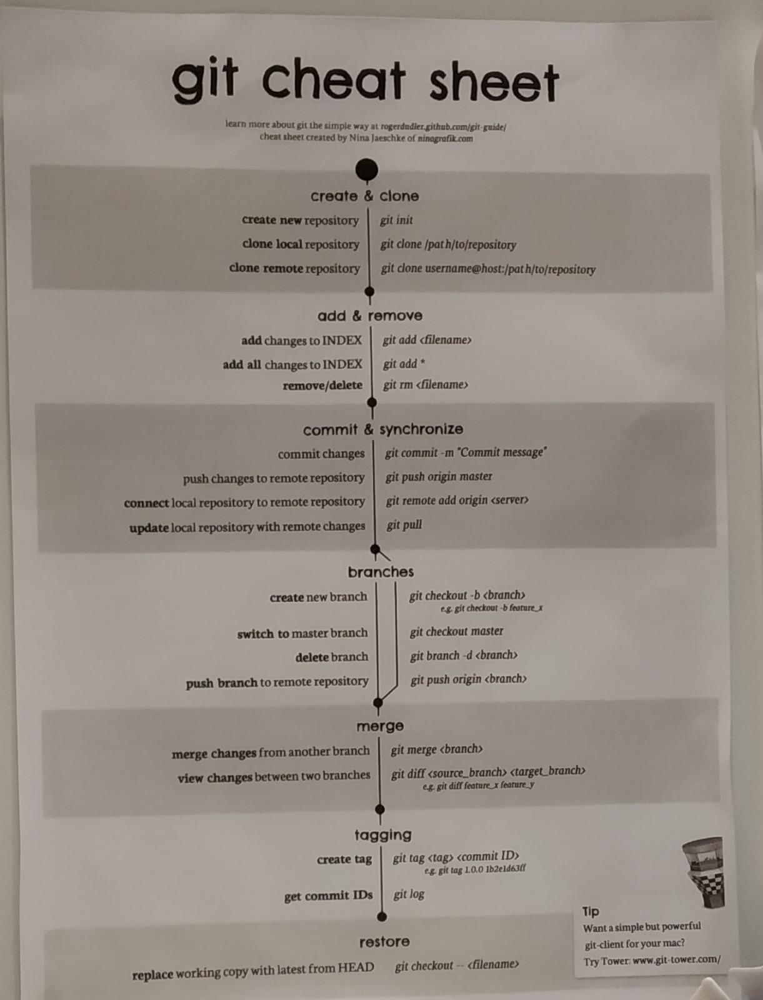

# Temel Git Komutları

İstersen [buraya](https://docs.gitlab.com/ee/gitlab-basics/start-using-git.html) tıklayarak GitLab'ın hazırladığı özet bilgiye erişebilirsin.

> Sayfanın en altındaki özet git komutlarına bakmak için [buraya](#git-cheat-sheet) tıklayabilirsin. (*Git Cheat Sheet*)

## Git'in Kullanıldığı Siteler

* [Github](https://www.github.com)
  * En sık kullanılandır.
  * Gizli repolar için ücret talep etmekte.
* [GitLab](https://gitlab.com/)
  * Github alternatifi olan bu site gizli repoları ücretsiz sunar.
* [Bitbucket](https://bitbucket.org/)


## Git Kimlik Bilgilerini Ayarlama

```bash
git config --global user.email "you@example.com"
git config --global user.name "Your Name"
```

### Git Deposunu Oluşturma

Detaylı bilgi için [buraya](https://www.atlassian.com/git/tutorials/setting-up-a-repository/git-clone) bakabilirisin.

#### Yeni repository oluşturma

```bash
git init
```

> Git için gerkeli olan dosyaları oluşturur.

#### Yerel repo klonlama

```bash
git clone [url] [kopyalanacağı yol]
```

* `url` Github'daki projenin adresi (https://...)
* `kopyalanacağı yol` Bilgisayardaki özel bir yol (C:\Desktop\Temp)

> Var olan git'i istenen dizine kopyalar

#### Belli branch'i klonlama

Çoklu değişimin olduğu projelerde sadece kendi branch'imiz üzerinden işlem yapmak isteyebilir ve diğer değişikliklerle uğraşmaya biliriz.

```bash
git clone -branch [branch_name] [url]
```

#### Uzak repo klonlama

```bash
git clone [username]@[host]:[url]
```

### Proje dosyalarımızın depoya eklenmesi

```bash
git add .
```

> Bütün dosyalar (. dizindeki tüm dosyalar demektir.) eklenir.

### Teslim etme hazırlığı ve yorum ekleme

```bash
git commit -m "Yorum" -m "Açıklama"
```

* -`m` message anlamına gelmektedir.

> Mesaj ve açıklama ile ile depoya teslim için hazırlama

### Teslim edilecek URL'i belirleme

```bash
git remote add origin [url]
```

* `url` Yüklemek istediğimiz yerin adresi

> Github için, projenizin konumuna gelip, *download kısmındaki kopyalama resmine* basarak, projenizin url'ini kopyalabilirsiniz.

### Teslim Etme

```bash
git push -u origin [branch]
```

* `branch` Varsa dal ismi (bilginiz yoksa 'master' kullanın)
  * git push -u origin master

> Master olarak url'e yükleme işlemi

## Branch İşlemleri

Branch (dal) git yığıtlarında imleç görevi gören araçlardır. Ek bilgi için [buraya](https://git-scm.com/book/tr/v1/Git-te-Dallanma-Dal-Nedir%3F) tıklayabilirsin.

> Genelde master işlemi (projenin aslı) ile test işlemlerini birbirinden ayrı yerlerde saklamak amaçlı kullanılırlar


> `HEAD` üzerinde bulunduğumuz branch'i (imleci | dalı) gösterir.

> `Yeşil renkli kareler` Commit işlemlerini gösterir.


## Branch (Dal) Oluşturma

```bash
git branch [branch_ismi]
```

> Yeni bir branch (imleç) oluştulur. Test işlemleri için sık kullanılırlar.

### Branch (Dal) Değiştirme

```bash
git checkout [branch]
```

* `branch` Seçilecek dal (HEAD (ana dal) için 'master' kullanılır)
  * git checkout master

> Seçili branch'i değiştiri. (Master iken test'e geçmek gibi)


## Faydalı git komutları

Zaman zaman gerekebilecek git komutları

## Git Üzerinde Kullanıcı Bilgilerini Saklama

```bash
git config --global credential.helper cache
git config --global credential.helper 'cache --timeout=3600'
```

> Detaylar için [buraya](https://help.github.com/articles/caching-your-github-password-in-git/) tıklayabilirsin.

### Remote Kaldırma & Gösterme

```bash
git remote -v
```

* `-v` Verbose, kontrol edilenleri gösterir.

```bash
git remote rm [branch]
```

* `branch` Kontrol türü. Mesela origin

> Detaylı açıklama için [buraya](https://help.github.com/articles/removing-a-remote/) tıklayabilirsin.

### Son hatalı yüklemeyi kaldırma

```bash
gir reset HEAD~
```

> Son yüklemeyi kaldırır. Bu işlemden sonra tekrar commit etmeniz gerekmekte. Detay için [link](https://stackoverflow.com/questions/927358/how-do-i-undo-the-most-recent-commits-in-git)

## Git Cheat Sheet


