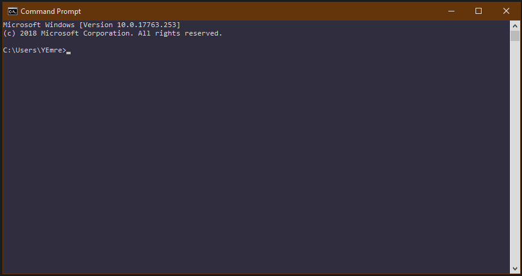

# Windows 10 Notları <!-- omit in toc -->

Sık kullanılan işletim sistemi notlarım.

## İçerikler <!-- omit in toc -->

> `HOME` tuşu ile yukarı yönlenebilrsiniz.

- [İndirme](#i%CC%87ndirme)
  - [Media creating tools kullanmadan indirme](#media-creating-tools-kullanmadan-indirme)
- [Kısayollar](#k%C4%B1sayollar)
  - [Uygulama İşlemleri](#uygulama-i%CC%87%C5%9Flemleri)
  - [Gezimti](#gezimti)
  - [Girdi İşlemleri](#girdi-i%CC%87%C5%9Flemleri)
  - [Menü Kısayolları](#men%C3%BC-k%C4%B1sayollar%C4%B1)
- [Command Promp (CMD)](#command-promp-cmd)
  - [CMD Komutları](#cmd-komutlar%C4%B1)
  - [CMD Değişkenleri](#cmd-de%C4%9Fi%C5%9Fkenleri)
    - [Temel Kullanım](#temel-kullan%C4%B1m)
    - [Sık Kullanılanlar](#s%C4%B1k-kullan%C4%B1lanlar)
- [Görsellik](#g%C3%B6rsellik)
  - [Command Promt](#command-promt)
- [Windows Features](#windows-features)
  - [Default Windows Features](#default-windows-features)
- [Ayarlar](#ayarlar)

## İndirme

*Windows 10 October 2019 EN* orjinal dosyasını [buradan](https://drive.google.com/open?id=1uzLjabuUUVYaOuRM2f5fX4HtHrb9XMgI) indirebilirsin.
Wİndows 10 son sürümünü indirmek için [buraya](https://www.microsoft.com/tr-tr/software-download/windows10) tıklayabilirsin.

### Media creating tools kullanmadan indirme

Siteye girdiğinizde sırasıyla alttaki ayarları açamınız | seçmeniz gerekmekte:

* Geliştirici Ayarları
* *Network conditions*
* *User Agent* başlığı altında
  * *Select automatically* seçimini kaldırın
  * *Safari – iPad iOS 9*
* Sayfayı yenileyin

> Detaaylı bilgi için [buraya](https://pureinfotech.com/download-windows-10-iso-without-media-creation-tool/) tıklayabilirsin.

## Kısayollar

> Bu kısayollar tüm ekranlara baskınkın, her yerde çalışır.

### Uygulama İşlemleri

* `CTRL` + `W` Pencereyi kapatır
* `ALT` + `F4` Uygulamayı ve pencerelerini kapatır
* `WİNDOWS TUŞU (SUPER)` + `E` File explorer'ı açar (Dosya Gezgini)
* `WİNDOWS TUŞU (SUPER)` + `R` Komutla uygulama çalıştırma penceresi
* `WİNDOWS TUŞU (SUPER)` + `<SAYI>` Taskbardaki (görev çubuğu / alttaki bar) sıralamaya göre uygulamları gösterir | çalıştırır / gizler
* `WİNDOWS TUŞU (SUPER)` + `SHIFT` + `<SAYI>` Üsttekine ek olarak, yeni bir tane açar
* `WİNDOWS TUŞU (SUPER)` + `G` Kayıt işlemleri, ekran görüntüsü vs.
* `WİNDOWS TUŞU (SUPER)` + `X` Windows araçları bölümü
* `WİNDOWS TUŞU (SUPER)` + `YUKARI YONU` Uygulamayı tam ekran yapma
* `WİNDOWS TUŞU (SUPER)` + `AŞAĞI YONU` Uygulamayı küçük ekran yapma

### Gezimti

* `ALT` + `TAB (Sola Sağa Ok Tuşu)` Uygulamalar arası gezinti
* `CTRL` + `WİNDOWS TUŞU (SUPER)` + `<YON TUŞLARI>` Masaüstleri arası gezinti
* `WİNDOWS TUŞU (SUPER)` + `D` Masaüstünü gösterme / geri alam
* `WİNDOWS TUŞU (SUPER)` + `M` Tüm uygulamaları gizleme (masaüstünü gösterme gibi)
* `WİNDOWS TUŞU (SUPER)` + `,` Anlık masaüstüne bakma
* `WİNDOWS TUŞU (SUPER)` + `L` Oturumu kitleme

### Girdi İşlemleri

* `WİNDOWS TUŞU (SUPER)` + `V` Son kopyalananları gösterir (Clipboard / Pano)
* `WİNDOWS TUŞU (SUPER)` + `Ş` veya `.` Emoji ekleme 👌
* `WİNDOWS TUŞU (SUPER)` + `SHIFT` + `S` Bell bir alanın ekran görüntüsü alma

### Menü Kısayolları

* `WİNDOWS TUŞU (SUPER)` + `I` Ayarlar menüsü
* `WİNDOWS TUŞU (SUPER)` + `U` Görünüm ayarları
* `WİNDOWS TUŞU (SUPER)` + `P` Ekran yansıtma ayarları
* `WİNDOWS TUŞU (SUPER)` + `K` Ağdaki cihaza bağlanma
* `WİNDOWS TUŞU (SUPER)` + `A` Aksiyon Merkezi (Action Center) menüsü
* `WİNDOWS TUŞU (SUPER)` + `Q` veya `S` Arama penceresini açma
* `WİNDOWS TUŞU (SUPER)` + `W` Windows INK çalışma alanını açma

## Command Promp (CMD)

### CMD Komutları

| Komut | Açıklama |
|-------|----------|
| `cls` | Konsolu temizleme |
| `cd <path>` | Dizin değiştirme |
| `mkdir <dirname>` | Klasör oluşturma |
| `start <file | folder>` | Dosya veya dizin açma |
| `del <switch> <file>` | Dosya silme |
| `rd <switch> <folder>` | Dizin silme |

* `<switch>` **/?** yazdığınızda çıkan /'li karakterler.
* `<file | folder>` Dosya ve veya dizin yolu

> Komut kullanımı CMD üzerinden öğrenmek için `<command> /?` yazabilirsin.

### CMD Değişkenleri

Ayrıntılı bilgi için [buraya](https://ss64.com/nt/syntax-variables.html) tıklayabilirsin.

#### Temel Kullanım

```cmd
<command> %<env_var>%
```

> Enviroment Variables yönetimi için `Bilgisayarım` - `Sağ Tık` - `Özellikleri` - `Gelişmiş Sistem Seçenenekleri` - `Ortam Değişkenleri`

#### Sık Kullanılanlar

* `.` Bulunan dizin (working directory)
* `..` Bir üst dizin (parent directory)
* `%username` Kullanıcı adı
* `%appdata%` Uygulama verileri dizini

## Görsellik

Kendime özgü görsellik ayarlarım

### Command Promt



* `**Font:**` *14 - Consolas*
* **Layout:** *Windows Size - w: 120 h: 30*
* **Color**
  * **Screen Text:** *R: 242 G: 242 B: 242*
  * **Screen Background** *R: 50 G: 47 B: 65*
  * **Opacity** *%89*
  
## Windows Features

> Aramaya alanına `Turn Windows Feature On or Off` veya `Windows Özelliklerini Aç veya Kapat` yazarak erişebilirsin.

### Default Windows Features

* `.NET Framework 4.7 Advanced Services`
  * `WCF Services`
    * `TCP Port Sharing`
* `Internet Explorer 11`
* `Media Features`
* `Microsoft Print to PDF`
* `Microsoft XPS Document Writer`
* `Print and Document Services`
  * `Internet Printing Client`
  * `Windows Fax and Scan`
* `Remote Differential Compression API Support`
* `SMB Direct`
* `Windows PowerShell 2.0`
* `Work Folders Client`

## Ayarlar

| Ayar | Ulaşım | Açıklama | Kaynak |
|------|--------|----------|--------|
| Altyazı | Options - Ease of Access -  Hearing / Closed captions | Yerel uygulamalardaki altyazı metnini özelleştirme | [Microsoft](https://support.microsoft.com/en-us/help/3078107/closed-captions-in-movies-tv-content-on-windows-10)